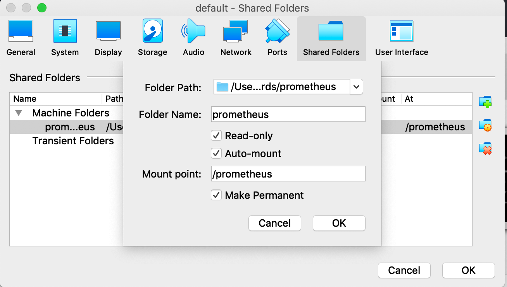

# Spot Hero Coding Assignment 

# Introduction

[Details for requirements](https://gist.github.com/andrew-kirkham/0ac2d1eda026d83f604a826817f09113)

## Build the Code
```bash
$ make javaBuild
```


## Deploy to Docker Machine 
```bash
# Enable Docker Machine
$ brew install docker docker-compose docker-machine docker-machine-nfs
$ docker-machine create default --virtualbox-memory=4096 --virtualbox-no-share
# added prometheus mount point: see screenshot.png
$ docker-machine start default
$ eval $(docker-machine env default) # switch to docker context
$ make docker

# Runs on your local development docker machine on port 8280, actuator endpoints are on 8281
# ex. http://localdev:8280 # localdev is the dns for your docker machine. 
# you can add this value to /etc/hosts  ex. 192.168.99.117 localdev

# Open Api can test the code from a browser (Swagger): http://localdev:8280/swagger-ui.html
# Metrics: http://localdev:9280/#/wallboard

# To stop the container: docker-compose stop
```

## Setup for virtualbox

